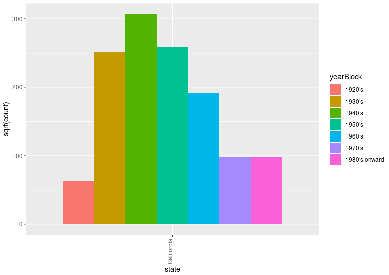

# Lab 5: On Vaccines

**Assigned** : Wednesday, 16th October 2024

**Due** : Wednesday, 30th October 2024



Figure 1: A grouping the counts of infections by year. The code for this plot is provided in this lab.

## Objectives

The main goals of this work are the following.

+ To enhance the understanding of the exploratory data analysis
+ To practicing skills of data transformation.
+ To investigate the issues of ethics, privilege and inequality surrounding vaccine refusal.

## Reading Assignment

Please read Chapters 3 and 5 in the course book, corresponding to Chapters 5 and 7 in the website (online) version of the book. You may be required to look up the syntax of coding to prepare types of plots as you go through this lab.

## Exploratory Data Analysis On Vaccines

Vaccines have helped save millions of lives. In the 19th century, before herd immunization was achieved through vaccination programs, deaths from infectious diseases, like smallpox and polio, were common. However, today, despite all the scientific evidence for their importance, vaccination programs have become somewhat controversial.

The controversy started with a paper published in 1988 and lead by Andrew Wakefield claiming there was a link between the administration of the measles, mumps and rubella (MMR) vaccine, and the appearance of autism and bowel disease. Despite much science contradicting this finding, sensationalistic media reporting and fear mongering from conspiracy theorists, led parts of the public to believe that vaccines were harmful. Some parents stopped vaccinating their children as a result of wide-felt fear. However, the Center for Disease Control (CDC) estimated that vaccinations prevented more than 21 million hospitalizations and 732,000 deaths among children born in the last 20 years. For more information on this, please see _Benefits from Immunization during the Vaccines for Children Program Era United States_, 1994-2013, [MMWR](https://www.cdc.gov/mmwr/preview/mmwrhtml/mm6316a4.htm).

Effective communication of data is a strong antidote to misinformation and fear mongering. In this lab you are going to prepare a report to have ready in case you need to help a family member, friend or acquaintance that is not aware of the positive impact vaccines have had for public health.

The data used for these plots were collected, organized and distributed by the [Tycho Project](www.tycho.pitt.edu). To find more about this dataset, load the its library, view the data and read the code book using the below commands.

``` R
rm(list = ls()) # clear out the variables from memory to make a clean execution of the code.

# If you want to remove all previous plots and clear the console, run the following two lines.
graphics.off() # clear out all plots from previous work.

cat("\014") # clear the console

# Install libraries

if(!require('tidyverse')) {
  install.packages('tidyverse')
  library('tidyverse')
}

if(!require('dslabs')) {
  install.packages('dslabs')
  library('dslabs')
}

if(!require('dplyr')) {
  install.packages('dplyr')
  library('dplyr')
}

if(!require('gridExtra')) {
  install.packages('gridExtra')
  library('gridExtra')
}

data(us_contagious_diseases)
View(us_contagious_diseases)

# View the built-in information on the data set
?us_contagious_diseases

# Assign the data set for the vaccine information to the dat variable
dat <- us_contagious_diseases
```

---

## Part 1. Steps to Follow

Note: As you complete the below steps to write your code (using File `src/code.r`), you will find numbered questions to address which are to be addressed in the File `writing/reflection.md`.

### 1. Begin with the above code block to install the libraries

+ 1.1 Describe this dataset; What types of data does it contain?

+ 1.2 Name two types of questions that you could expect to answer using this dataset.

### 2. Create a new dataset

+ Create a dataset called `dat` by assigning it to the `us_contagious_diseases` dataset. You should now see this variable, `dat`, pop-up in your Global Environment section of RStudio.

### 3. Create another dataset

+ Create another dataset from `dat` called `dat_measles_rate` having the following criteria.

+ This new dataset contains rows concerning only Measles data. Hint: use `filter()` on the dataset, `dat`.

+ Add a new column to this dataset called `rate` using the `mutate()` function. To create a `rate` variable, you are invited to use the below equation which combines several other variables together, however, if you think of a new way to create a `rate` variable from the data for your analysis, please feel free to try it. Be sure to discuss your own `rate` in your lab deliverable.

    + $rate = \frac{C*52}{Wr} / \frac{P}{100000}$,
     for which

    + $Wr = weeksReporting$

    + $C = count$

    + $P = population$

  Note: the above variables have been written using markdown formatting to show mathematical notation.

### 4. Question: Rate

+ 4.1. What kind of data is contained in the created `rate` column?

+ 4.2. In terms of its informational content, how could this column be useful in an analysis?

### 5. Create a new dataset

+ Because they became states recently, remove the two states (_Alaska_ and _Hawaii_) from your dataset. For this, create a variable for a new dataset called, `dat_measles_rate_lessTwoStates` from the `dat_measles_rate` dataset. The new dataset will not have rows pertaining to the two states. For this step, use the `filter()` function to remove _Alaska_ and _Hawaii_.

### 6. Questions: Studying results from plots

+ Prepare a plot of the dat `measles_rate_lessTwoStates` dataset that relates the data of 48 states by editing the provided code. Set your _x_ and _y_ variables to `year` and `rate`, respectively. Be sure to add a relevant title to the code where appropriate. A hint for the syntax of your code is provided below.

+ 6.1 Describe this plot; What information does it contain? Is there any evidence of a pattern that you see? Explain.

+ 6.2 What is significant about the red vertical line? (You may have to go online to search for this answer.)

``` R
ggplot(data = dat_measles_rate_lessTwoStates,
  mapping = aes(
    x = ADD_VARIABLE_HERE, 
    y = ADD_VARIABLE_HERE, color = year)) +
    geom_point() +
    geom_vline(xintercept = 1963, color = "red") +
    labs(y = "ADD A TITLE")

```

### 7. Create a new dataset

+ Create a dataset from `dat_measles_rate_lessTwoStates`, called `dat_caliFocus` in which California is the __only__ state data present in the set.

### 8. Creating more plots

+ Prepare a plot of this dataset where _x_ is the `year` and _y_ is the `rate`. Hint, modify the given plotting code from above to make a plot for `dat_caliFocus`.
  
+ 8.1 In clear and meaningful language, interrupt your results from the plot.
  
+ 8.2 Compare the plot from the dataset  `dat_caliFocus` to the plot from the dataset `dat_measles_rate_lessTwoStates`. Could California be used to represent the rest of the country in terms of general and similar patterns? Why or why not? What are these patterns?

+ 8.3 Describe what both of these plots are showing. Why do you suppose the analysis that you have just completed so revolutionary in medical science?

### 9. Comparing years, 1950, 1960 and 1970

+ Create variables `mea_1960`, `mea_1960_sqrt`, `mea_1970`, `mea_1970_sqrt` by copying and editing the provided code for the variables,  `mea_1950`, `mea_1950_sqrt`.

``` R
dat <- us_contagious_diseases

mea_1950 <- dat %>% filter(year == 1950) %>% ggplot(aes(x = count)) + geom_histogram(bins = 15, fill = "grey", col = "black") + facet_grid(~year) + theme_classic() + xlab("Total Measles Cases") + ylab("Frequency by state") + scale_y_continuous(expand = c(0,0))

mea_1950_sqrt <- dat1 %>% filter(year == 1950) %>% ggplot(aes(x = sqrt(count))) + geom_histogram(bins = 15 ,fill = "grey", col = "black") + facet_grid(~year) + theme_classic()+ xlab("Total Measles Cases (square-rooted) ") + ylab("Frequency by state") + scale_y_continuous(expand = c(0,0))
```

Once all the above variabes have been created, use the following code to create a panel plot.

``` R
grid.arrange(mea_1950,mea_1950_sqrt,mea_1960, mea_1960_sqrt, mea_1970,mea_1970_sqrt,nrow = 3, ncol = 2)
```

### 10. Questions: Panel plot

+ 10.1 Describe the resulting plot.

+ 10.2 Applying a square-root function to data points is called a transformation. What is the difference between the plots using the transformation to those that do not use the transformation for the same years?

### 11. Interpretation

+ 11.1 Enter the below code and offer an interpretation of the resulting plot.

``` R
dat_measles_rate %>%
  filter(!is.na(rate)) %>% mutate(state = reorder(state, rate, FUN = mean)) %>%
  ggplot(aes(year,rate, color = state)) + geom_line(alpha = 0.5) + theme_classic() + theme(axis.text.x = element_text(angle = 90, hjust = 1)) + scale_y_sqrt() + stat_summary(fun.y=mean, geom="line",lwd=0.7,col="black") + annotate("text", x = 1950, y = 490, label = "US average", size = 3) + ggtitle("US Measles Distribution") + annotate("text", x = 1963, y= 2000, angle = 90, label = paste("paste(Vaccine)", collapse = "_"), vjust = 1.2, parse = TRUE, size = 2.5) + geom_vline(xintercept = 1963, col = "grey")
```

### 12. Interpretation

+ 12.1 Enter the below code and offer an interpretation of the plot.

``` R
dat_measles_rate%>% filter(!is.na(rate)) %>%
  ggplot(aes(year, state)) + geom_tile(aes(fill = rate), color = "white") + scale_fill_gradient(low = "white", high = "blue", trans = "sqrt") + scale_x_continuous(expand = c(0,0)) + ggtitle("Measles disease rate per year in the United States") + theme(plot.title = element_text(hjust = 0.5)) + geom_vline(xintercept = 1963, col = "black")
```

---

## Part 2. Writing About Ethics

Please address the file, `writing/reflection.md`.

+ In the `reading/` directory of your project repository, there is an article to read; _Journal Retracts 1998 Paper Linking Autism to Vaccines_, By Gardiner Harris. Please read the article and address the reflection questions in your `writing/reflection.md` work file.

### Important Details

All of your R code should be executable without errors. All writing to address questions is to be added to the `writing/reflection.md` document.
Note: Please remember to include your name on everything you submit for the class.

---

### Required Deliverables

+ A complete and executable source code in File, `src/code.r`. Your instructor should be able to run the file without additional editing.

+ Complete the `writing/reflection.md` containing your responses to the above questions.

### Checks for GatorGrader

For immediate feedback on submissions, we will be using Gator Grade to inform the of missing components in the submission. As you submit, you will notice that there is a thick red X that will change to a green check mark when all components have been included in the submission. You are encouraged to click on the red X to find a listing of the components to address.

## Project Assessment

The grade that a student receives on this assignment will have the following components.

+ **GitHub Actions CI Build Status [up to 15%]:**: For the lab repository associated with this assignment students will receive a checkmark grade if their last before-the-deadline build passes. This is only checking some baseline writing and commit requirements as well as correct running of the program. An additional reduction will given if the commit log shows a cluster of commits at the end clearly used just to pass this requirement. An addition reduction will also be given if there is no commit during lab work times. All other requirements are evaluated manually.

+ **Mastery of Technical Writing [up to 65%]:**: Students will also receive a checkmark grade when the responses to the writing questions presented in the `reflection.md` reveal a proficiency of both writing skills and technical knowledge. To receive a checkmark grade, the submitted writing should have correct spelling, grammar, and punctuation in addition to following the rules of Markdown and providing conceptually and technically accurate answers.

+ **Mastery of Technical Knowledge and Skills [up to 20%]:** Students will receive a portion of their assignment grade when their program implementation reveals that they have mastered all of the technical knowledge and skills developed during the completion of this assignment. As a part of this grade, the instructor will assess aspects of the programming including, but not limited to, the completeness and the correctness of the program and the use of effective source code comments.

## GatorGrade

You can check the baseline writing and commit requirements for this lab assignment by running department's assignment checking `gatorgrade` tool. To use `gatorgrade`, you first need to make sure you have Python3 installed (type `python --version` to check). If you do not have Python installed, please see:

+ [Setting Up Python on Windows](https://realpython.com/lessons/python-windows-setup/)
+ [Python 3 Installation and Setup Guide](https://realpython.com/installing-python/)
+ [How to Install Python 3 and Set Up a Local Programming Environment on Windows 10](https://www.digitalocean.com/community/tutorials/how-to-install-python-3-and-set-up-a-local-programming-environment-on-windows-10)

Then, if you have not done so already, you need to install `gatorgrade`:

+ First, [install `pipx`](https://pypa.github.io/pipx/installation/)
+ Then, install `gatorgrade` with `pipx install gatorgrade`

Finally, you can run `gatorgrade`:

`gatorgrade --config config/gatorgrade.yml`

## Submitting Your Work

Use GitHub to submit your work. The commands are the following.

```
git add -A
git commit -m "add meaningful commit message"
git push
```

## Seeking Assistance

Students who have questions about this project outside of class or lab time are invited to ask them in the course's Discord channel or during instructor's or TL's office hours.
